<div align="center">

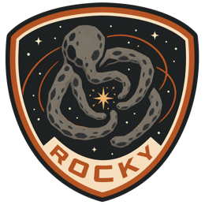

# Rocky

**Practice for the interview you actually want.**

Rocky turns your résumé and a real job description into a live interview,
then tells you what your answers actually proved.

[Live demo](https://app-2c7f-8000.prg1.zerops.app) ·
[Video walkthrough](https://youtu.be/3f3UjxkfLP0) ·
[Write-up](https://medium.com/@paveenkumar.dev/rocky-3717406e2db2) ·
[X](https://x.com/paveen_kumar06/status/2086513152213266615)

<br />

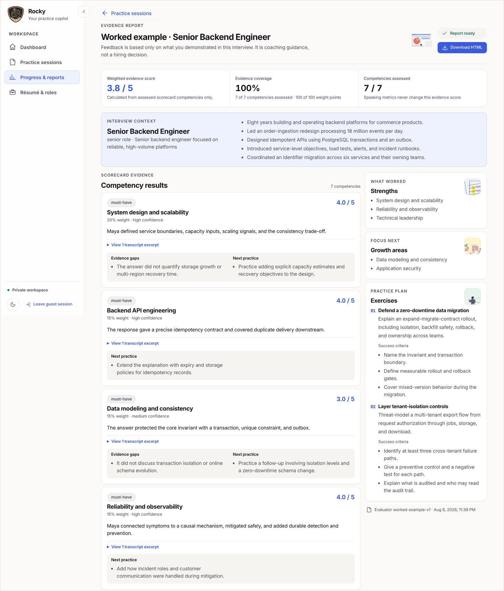

<sub>What you get at the end: a score per competency, the transcript excerpt behind it, and what to practise next.</sub>

</div>

---

## The problem

Interview preparation is mostly guesswork.

You read a list of "top 50 questions" that has nothing to do with the job you
applied for. You rehearse in front of a mirror and can't tell whether the answer
landed. A friend does a mock interview, is kind about it, and you leave with
"that was good!" — which is not feedback, it's encouragement.

The three things that would actually help are the three things that are hardest
to get:

1. **Questions that match this role**, not a generic template.
2. **An interviewer who follows up** when your answer is vague, the way a real
   one does.
3. **Honest feedback tied to what you actually said** — not a vibe, not a score
   out of ten that nobody can explain.

A good human coach solves all three, and costs money most people preparing for
their first or next job don't have.

## How Rocky solves it

You give Rocky two things you already have: your résumé and the job description
you're applying to. From there it does what a good interviewer does.

**It reads your résumé into evidence.** Every claim it extracts stays linked to
the exact line in your document it came from. You can correct anything before
the interview starts. Nothing gets invented on your behalf.

**It turns the job description into a scorecard.** The role's actual
requirements become weighted competencies — must-haves and nice-to-haves, adding
up to 100%. You can edit the weights. This scorecard is the entire agenda for
the interview and the entire basis for your feedback.

**It runs a real conversation.** You speak, Rocky listens, and it asks the
follow-up your answer invited. It's a voice interview by default; if you're
somewhere you can't speak, there's a quiet text mode that keeps the camera and
microphone switched off completely.

**It reports evidence, not vibes.** Afterwards you get a score per competency,
each one attached to the sentence in your transcript that earned it, plus the
gaps, what remains uncertain, and a short practice drill for next time. If a
competency never came up, it says "not assessed" instead of guessing.

That last point is the rule the whole product is built around: **if Rocky can't
point at the words you said, it doesn't get to make the claim.**

---

## Take the tour

### The landing page

You can start without creating an account. Guest access takes a name and an
email, and drops you into a workspace with a worked example already in it, so
you can read a finished report before spending twenty minutes producing one.

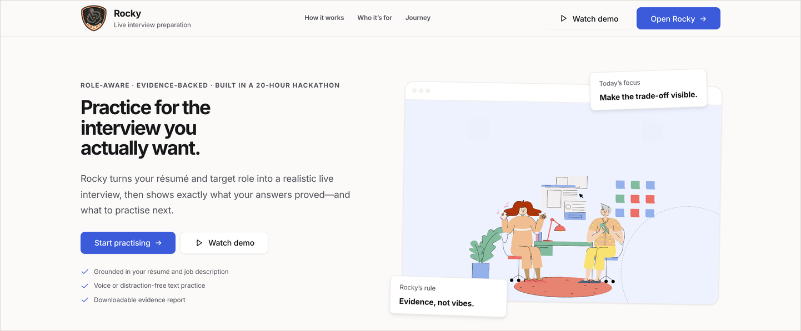

### Your workspace

Sessions you've started, reports that are ready, and the one thing worth
practising next.

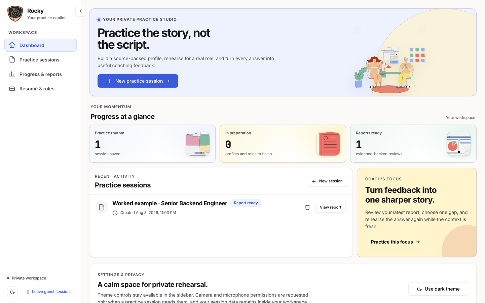

### 1 · Résumé becomes evidence

Upload a PDF or DOCX. Rocky extracts claims and groups them into summary,
experience, skills and education — and every single one links back to the
paragraph it came from. Edit anything that's wrong. The original file is
discarded as soon as the text is extracted; only the extracted text and your
corrections are kept.

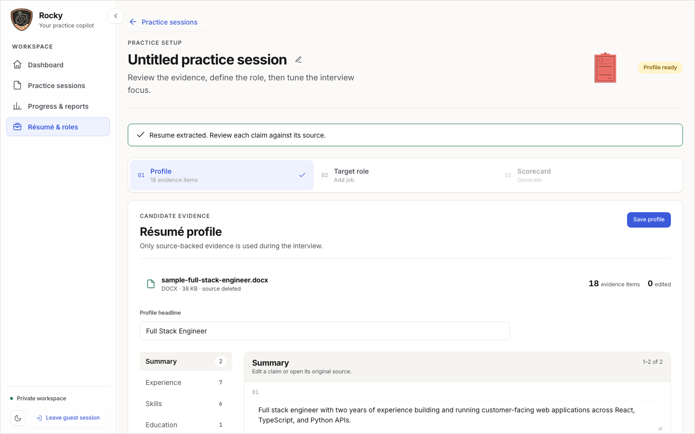

No résumé handy? There are two built-in samples, and they go through exactly the
same upload path a real file does.

### 2 · Job description becomes a scorecard

Paste the advert, pick a seniority, and Rocky drafts the competencies the
interview should cover, weighted. Open any one to change its weight or drop it.
You can't save a scorecard whose weights don't total 100% — the report's maths
depends on it.

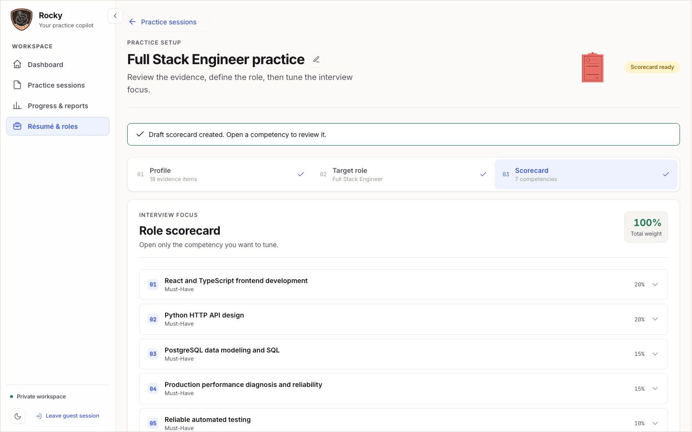

### 3 · Preflight

Audio gets checked before the timer starts, not during. Pick a length (2, 5, 15,
30, 45 or 60 minutes), pick the interview type, and opt in — separately and
explicitly — to speaking-delivery coaching and on-camera coaching. Both are off
by default. Preflight and the interview hide the sidebar; there is nothing to
navigate to while a timer is running.

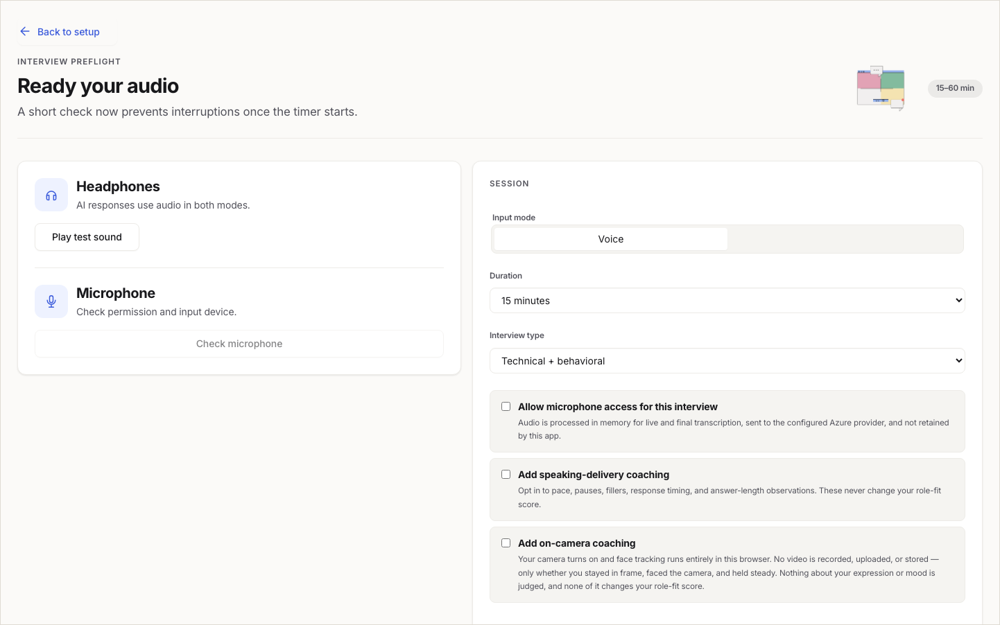

### 4 · The interview

A timer, a live transcript, and one question at a time. Voice activity detection
sends your answer when you pause, so there's no button to hunt for mid-sentence.
Every answer is transcribed twice: once live so you can see it immediately, and
once again afterwards with a more accurate model, which quietly replaces the
live text.

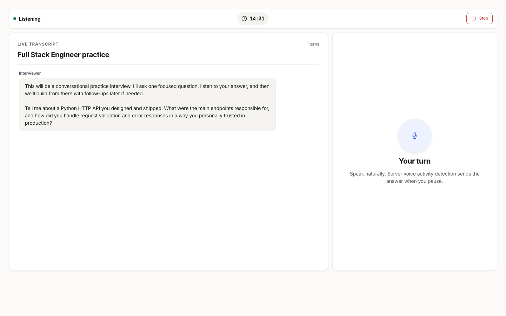

If the connection drops, you reconnect and carry on. A submitted answer never
gets duplicated.

### 5 · The report

The report at the top of this page, in full: a weighted score, coverage (how
much of the scorecard the interview actually reached), and per-competency
feedback with the transcript excerpt behind it. Strengths, growth areas, a
practice plan with success criteria, and an explicit list of what remains
uncertain.

If you opted into delivery coaching, speaking pace, filler density and answer
length appear in their own section — clearly marked as never affecting your
role-fit score.

The whole thing downloads as a single self-contained HTML file you can keep.

### Dark mode and small screens

<p align="center">
  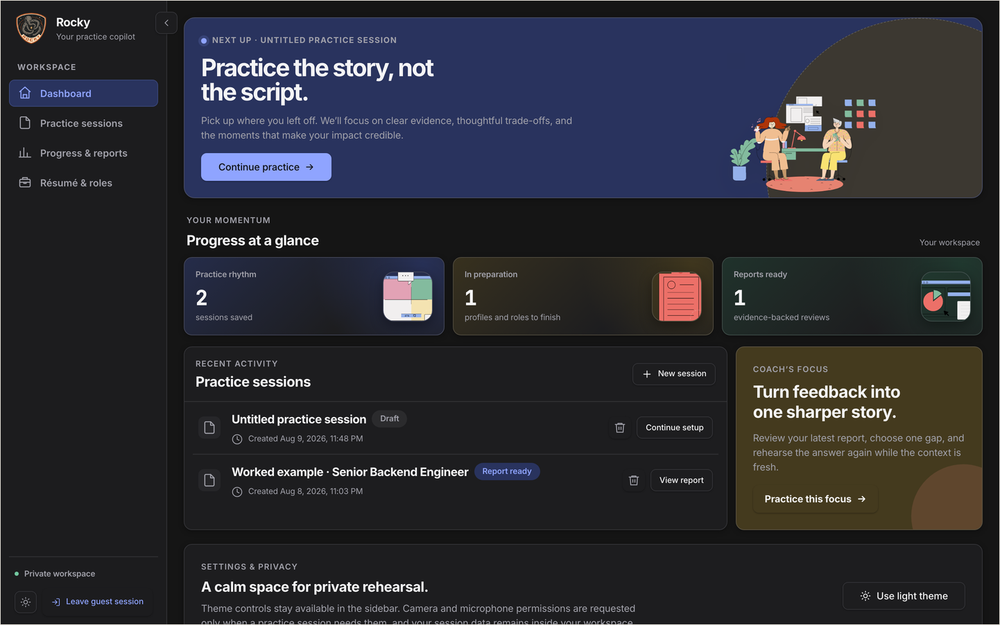
  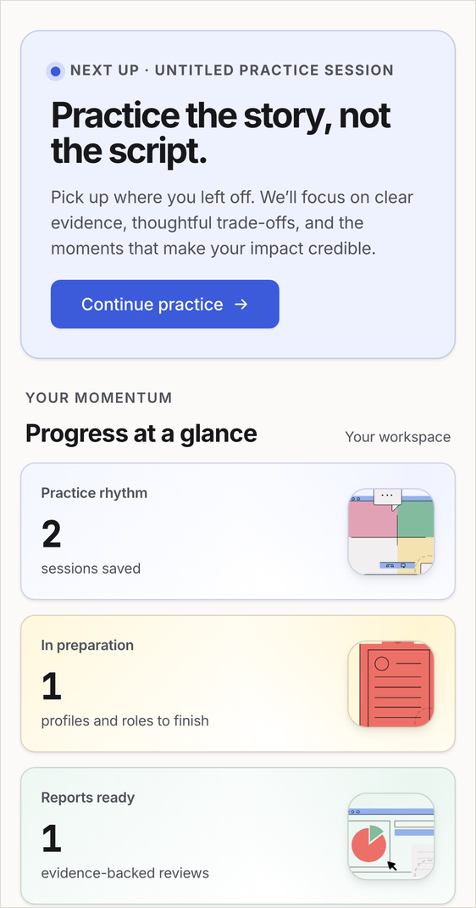
</p>

---

## Who it's for

Anyone who has to be understood in a room: students and freshers before campus
placements, professionals moving to a new role, career switchers who need to
retell their story for a different audience, and the trainers, mentors and
placement teams who coach them.

It is a coaching tool, not a hiring tool. Rocky never makes a hiring decision
and never pretends to.

## What Rocky deliberately does not do

- **It does not keep your résumé.** The file's bytes are discarded straight
  after text extraction.
- **It does not record you.** Answer audio is streamed through the API to the
  transcription provider from memory and never touches disk on either side. No
  video is uploaded or stored at all.
- **On-camera coaching runs entirely in your browser.** Face tracking is
  WebAssembly running locally; what leaves the page is whether you stayed in
  frame, faced the camera and held steady. Nothing about your expression, mood
  or personality is inferred or judged.
- **It does not score personality.** Speaking metrics are observations about
  pace and pauses, kept in a separate section, and never touch your evidence
  score.
- **It does not invent evidence.** Any AI-produced claim without a matching
  quote from your own words is rejected by the server rather than stored.

---

## The technical part

### How it fits together

<p align="center">
  <picture>
    <source media="(prefers-color-scheme: dark)" srcset="docs/diagrams/product-flow-dark.svg" />
    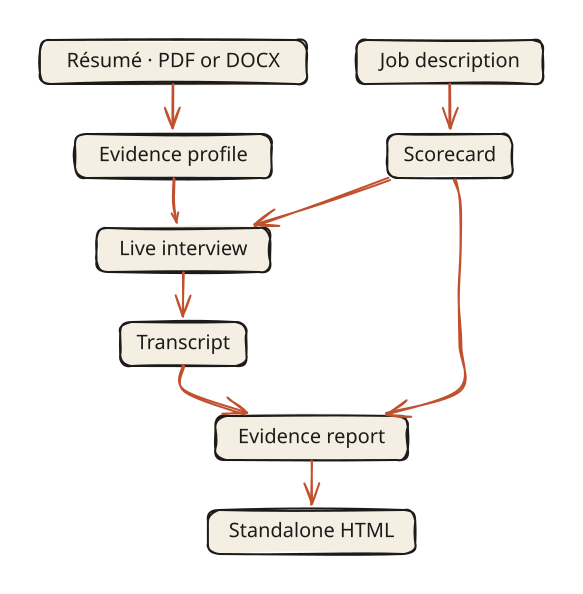
  </picture>
</p>

The scorecard is frozen when the interview starts, so the questions you were
asked and the criteria you're judged against can never drift apart.

And the runtime picture, which is deliberately boring — one origin, one process:

<p align="center">
  <picture>
    <source media="(prefers-color-scheme: dark)" srcset="docs/diagrams/runtime-dark.svg" />
    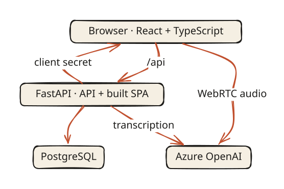
  </picture>
</p>

Two details worth calling out. The permanent Azure key never leaves the server —
the browser is handed a short-lived client secret and the fixed Azure WebRTC
URL, and nothing else. And FastAPI serves the built React app itself, so there
is no second domain, no CORS configuration, and one thing to deploy.

### Stack

| Layer | What's there |
| --- | --- |
| Frontend | React 19, TypeScript, Vite, plain CSS (no UI framework) |
| Backend | FastAPI, SQLAlchemy 2 async, Pydantic v2, Alembic |
| Database | PostgreSQL in production, file-backed SQLite locally |
| AI | Azure OpenAI — Realtime for the interview, structured output for extraction and evaluation, two transcription lanes |
| Face tracking | MediaPipe Tasks Vision, WebAssembly, in-browser only |
| Auth | Clerk in production, guest tokens, or a local developer identity |
| Hosting | Zerops, deployed from GitHub Actions on push to `main` |

### Repository layout

```text
server/
  api/routes/      HTTP surface: intake, realtime, evaluations, delivery,
                   interviews, operations, auth, health, capabilities
  api/services/    uploads, profile, scorecards, realtime, transcription,
                   evaluation, delivery, privacy, retention, worked example
  domain/          pure rules: intake, interview, evaluation, delivery
  prompts/         versioned prompts for résumé, scorecard, interview, evaluation
  migrations/      Alembic revisions
  tests/           pytest suite
web/
  src/             SetupPage, PracticePage, ReportPage, LandingPage,
                   realtime/voice/video capture, report export
docs/
  screenshots/     the images in this file
  diagrams/        the two diagrams above, as .excalidraw + .mmd + rendered SVG
  OPERATIONS.md    databases, migrations, retention, manual acceptance pass
zerops.yml         build + deploy pipeline
```

The diagrams are editable: open `docs/diagrams/*.excalidraw` at
[excalidraw.com](https://excalidraw.com) (File → Open), move a box, and re-export
over the matching SVG. The `.mmd` files are the original mermaid source they were
generated from.

### Run it locally

Python 3.11+ and Node 22.14+.

```bash
python -m venv venv && source venv/bin/activate
python -m pip install -e "./server[dev]"
npm --prefix web install
```

The default local setup uses SQLite and a fixed developer identity, so there is
no sign-in step and no accounts to create.

```bash
cd server && uvicorn api.main:app --reload
```

In a second terminal:

```bash
npm --prefix web run dev
```

Open `http://localhost:5173`, create a practice session, load one of the sample
résumés, and walk the flow. Without Azure credentials the résumé extraction
falls back to deterministic rules (`PROFILE_EXTRACTION_MODE=rules`) and the
interview itself won't connect — everything up to preflight still works.

### Configuration

Copy `.env.example` to `.env`. The values that matter most:

```text
# Azure OpenAI — the interview itself
AZURE_OPENAI_ENDPOINT=...
AZURE_OPENAI_API_KEY=...
AZURE_OPENAI_TEXT_DEPLOYMENT=gpt-5.6-luna
AZURE_OPENAI_REALTIME_DEPLOYMENT=gpt-realtime-2.1
AZURE_OPENAI_REALTIME_VOICE=alloy

# Both transcription lanes are required before a voice interview will start
AZURE_OPENAI_REALTIME_TRANSCRIPTION_MODEL=gpt-realtime-whisper
AZURE_OPENAI_FINAL_TRANSCRIPTION_DEPLOYMENT=gpt-4o-transcribe
AZURE_OPENAI_TRANSCRIPTION_LANGUAGE=en

# Local convenience
ENABLE_TEXT_DEV_MODE=true    # quiet text mode; keep this off in production
```

Those two transcription values must be your **Azure deployment names, not model
names**. They only look the same when the deployment was created with its
model's name. A wrong value fails at request time with
`transcription_deployment_missing`, not at startup.

Résumé intake limits are configurable and default to 5 MB, 10 PDF pages, 200,000
extracted characters and an 8-second extraction timeout. The server validates
extension, MIME type and file signature, and rejects encrypted, corrupt,
scanned-only, oversized and macro-enabled files.

Private-alpha guardrails default to 10 interviews and 20 evaluations per day per
user, with 30-day retention for transcripts, drafts and delivery metrics.

#### Authentication

- **`local`** — one fixed developer identity, no sign-in. The default, and what
  CI runs.
- **`guest`** — a name and an email issue a signed short-lived token. New guests
  get a pre-built worked example so the report is reachable immediately.
- **`clerk`** — the browser sends a Clerk session token; the server verifies
  signature, issuer, expiry and authorized party before trusting the subject.
  Required in staging and production.

Clerk's default session token carries neither email nor name, and the API
rejects a token without an email. Add them under **Configure → Sessions →
Customize session token**:

```json
{ "email": "{{user.primary_email_address}}", "name": "{{user.full_name}}" }
```

### Deploy

Production runs on Zerops: one application service plus managed PostgreSQL 17 on
the project's private network.

```bash
zcli login
zcli project project-import zerops-import.yml
```

Real secrets go in the Zerops GUI under **Service → Environment variables**; the
import file ships placeholders on purpose. After that, every push to `main` runs
[`.github/workflows/deploy.yml`](.github/workflows/deploy.yml), which needs the
repository secret `ZEROPS_TOKEN` and the variables `ZEROPS_SERVICE_ID` and
`APP_URL`. Zerops builds from [`zerops.yml`](zerops.yml): Vite compiles the
client, `alembic upgrade head` runs on container start, and readiness is gated on
`/api/health/ready`.

To build the single production artifact yourself:

```bash
npm --prefix web run build
cd server && uvicorn api.main:app --host 127.0.0.1 --port 8000
```

Database migrations, running against Neon or Supabase locally, and moving
existing data into Zerops are covered in
[docs/OPERATIONS.md](docs/OPERATIONS.md).

### Tests and checks

Backend, from `server/`:

```bash
python -m ruff format --check api domain evals migrations prompts scripts tests
python -m ruff check api domain evals migrations prompts scripts tests
python -m pytest tests
```

Frontend:

```bash
npm --prefix web run lint
npm --prefix web run typecheck
npm --prefix web run test
npm --prefix web run build
```

CI runs all of these on pull requests and on pushes to `main`.

There's also a manual acceptance pass that automated tests can't cover —
completing a voice interview end to end on current Chrome, Safari and Edge, and
confirming that a spoken answer appears once as live text and is then replaced by
the final transcript. Voice-mode latency and impaired-network behaviour stay
manual release checks.

---

## Where the name comes from

Rocky is the alien engineer from *Project Hail Mary* — the one who shows up,
doesn't speak your language, and helps you solve the problem anyway. That felt
like the right model for an interview copilot: calm, practical, on your side, and
much more interested in the next problem than in judging you.

The whole thing was built in a 20-hour hackathon. The
[landing page](https://app-2c7f-8000.prg1.zerops.app/#journey) has the hour-by-hour
version, and the [write-up](https://medium.com/@paveenkumar.dev/rocky-3717406e2db2)
has the honest one.

## Credits

Illustrations are from the **The Little Things** Blush collection by Susana
Salas; source and licence notes live in `design/assets/blush/SOURCES.md`. The
mission patch and everything derived from it are in `design/assets/brand/`.
